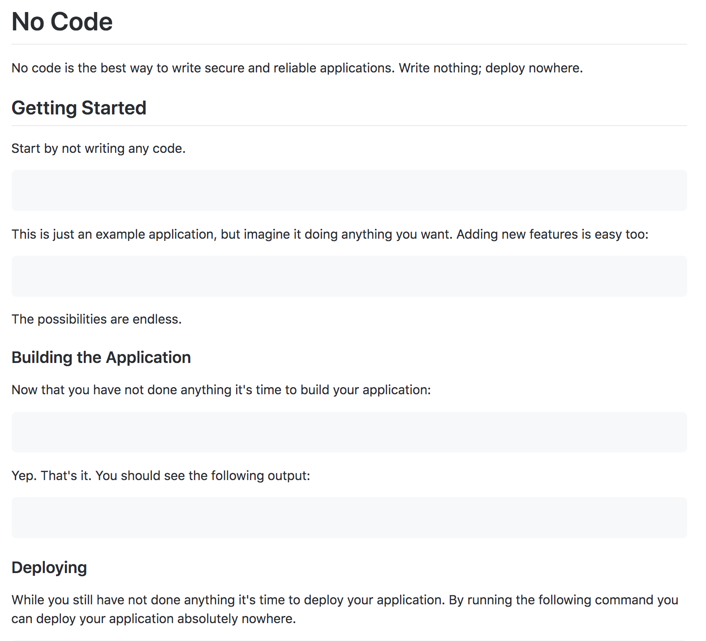
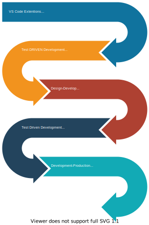

---

# What is GhostPlate?

A modern **remote centric** development environment for designers and developers stay connected and collaborate remotely by streamlining the software development life cycle.

---
# Features
1. Built in Collaboration Templates
2. Lightweight & "Frameworkless"
3. Build just about anything (web, server, mobile app and hardware)
4. Build a Car with spare parts
5. "Frameworkless"
6. Build just about anything

---

---
## How it works
Originally, I and the team were exploring the following options in order to giver users more flexibility.

1. Create Collaboration Templates with Draw.io so that designers and developer can effectively communicate design, logic and architecture problems at scale. 
2. A simple collection of [VS Code Extensions](https://marketplace.visualstudio.com/items?itemName=HansBashesMS.covid-working) centered around productivity aka a json file published the absolutely most horribly documented sales pitch for Azure. Because adopting a new IDE with the right extensions is easy.
2. Create Custom VS Code Extensions to improve github workflow with a SMART TODO List (completely abadoned)

2. Automate the Boring Stuff with around puppeteer.
3. Create a boilerplate GitPod wrapper companies can use to provide a universal development environment built on OSS like gitter, etc.

---
# Lightweight & "Frameworkless"
Most of have seen this my now

---

# Build just about anything from one boilerplate
### (web, server, mobile app & hardware)
Tools Available
1. Gatsby & Next 
2. Ionic
3. J5 - HardWare

---

---
## Film 3 Minuete Video

---

## Build a Car with spare parts

---

---

# Team Members

---

### "Hans McMurdy": Honey Badger, GEER

---

### 👻Bot  
To automate the dumb stuff in the simplist way possible

---

## Problem(s): Connecting Design & Development
1. The simplest way to help connect others isn't nessissarly to build an new app that you have to login to. 
2. Designer tend to be more extraverted
3. Designer & Developers have always had communication issues

---

## Problem(s):
1. Traditional Software Development Life Cycle

---

## Potential Solutions: 
1. Improved Software Development Life Cycle

---

## Potential Solutions: 
1. Improved Software Development Life Cycle

---

### 2.Automate the Boring Stuff at Scale

---

--- 
### Requirements to run
1.  Just needs a browser :-) 

--- 

## Tech stack used (i.e Node, React, Auth0, Jest, etc)
Visual Studio Code, Node.js, React, Ionic, Docker, GitPod, Johny5

---

## How to use it 
### (Including set up instructions/requirements, local development)

To Use Ionic there is substial setup that is a bit beyond me
- [Ionic Config](https://github.com/hpssjellis/ionic-webcam-help)

----
## Resources:
1 [GitPod](https://www.gitpod.io/blog/gitpodify/)