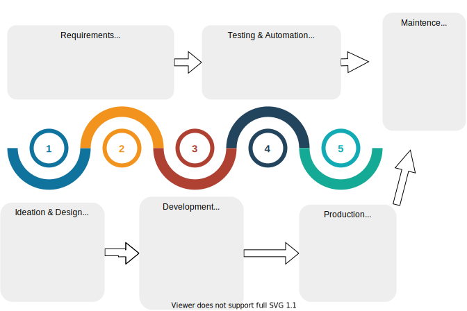

---
# What is GhostPlate?
A modern **development environment** for designers and developers stay connected and collaborate remotely by streamlining the software development life cycle.

---

# Features
1. "Frameworkless"
2. Simple docker-based configuration
3. Lightweight
4. Build a Car with spare parts
5. Build just about anything
5. 

---

# Tools Available
1. Gatsby
2. 

---
### TO DO

- [ ] Film 3 Minuete Video
- [ ] Problem
- [ ] Solution(s)
- [ ] Build a Car with spare parts
- [ ] Automate the dumb stuff
- [ ] Saturn
- [ ] Uranus
- [ ] Neptune
- [ ] Comet Haley

---

## Tips for Success
1. Use Your Resources
2. Don't over optimize
3. Focus on the MVP
4. Make a Great Pitch

## About
The goal of this project is to provide a portable development environment that improves communication and remote collaboration while streamlining the Software Development Life Cycle (SDLC).

## Team Members

### Hans: Honey Badger, GEER
### 👻
### 👻

## Problem(s):
1. 

<!--  -->

## Potential Solutions
<!--  -->

1. The simplest way to help connect others
isn't nessissarly to build an new app that you have to login to. The simplest way to look around at whats wrong

## How it works
Currently exploring the following options:
1. A simple collection of [VS Code Extensions](https://marketplace.visualstudio.com/items?itemName=HansBashesMS.covid-working) centered around productivity aka a json file published the absolutely most horribly documented sales pitch for Azure.
2. Automate the Boring Stuff with a docker container built around puppeteer.
2. Create Custom VS Code Extensions to improve github workflow with a SMART TODO List
3. Create a boilerplate GitPod wrapper companies can use to provide a universal development environment built on OSS like gitter, etc.

### Requirements to run
1. Just needs docker :-)
2. Just needs VS Code
3. GitPod just needs a browser :-) 

## Tech stack used (i.e Node, React, Auth0, Jest, etc)
Visual Studio Code, Node.js, React, Ionic, Docker, GitPod

## How to use it (Including set up instructions/requirements, local development)
Hans will publish an extensive tutorial on this subject and include it in the development.

## Resources:
1 [GitPod](https://www.gitpod.io/blog/gitpodify/)