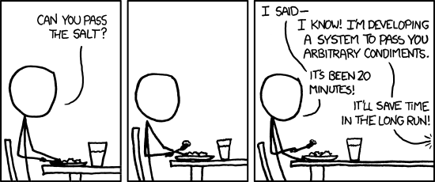

---

## What is GhostPlate?

A modern **remote centric** development environment for designers and developers stay connected and collaborate remotely by streamlining the software development life cycle.

---

## Ok, why does it matter to me?
How does this help me communicate with my team?

---

## It does a lot more than that...
Communication isn't a technology issue, it's a social and organizational issue. Trust me, I'm a sociologist who just happens to write code for a living to build emails, websites, apps, and ocationally servers & circuit board when I'm bored...

---

## Ok what does that mean?
Well, basically, I was trying to build a social network inside and IDE to connect designers, develpers, QA, and Project Managers so we all can spend less time in zoom and more time with family during a pandemic...

---

## Problem(s): Connecting Design & Development
1. The simplest way to help connect others isn't nessissarly to build an new app that you have to login to. 
2. Designer & Developers have always had communication issues

---

## Problem(s): Connecting Design & Development
So lets bring them into our IDE with chat feature, and design functionality...

Such as Responsive Design Tempates

---

## Problem(s): Connecting Design & Development 2
Or Affinity Maps...

---

## Problem(s): Traditional Software Development Life Cycle

---

## Potential Solutions: 
1. Improved Software Development Life Cycle

---

### 2.Automate the Boring Stuff at Scale
* Crawl your own site, generate styleguide or match that a page conforms to them (or not).
* Screenshot each page, with each modern browser, and also do it by breakpoint
* oh and don't forget to write the console.log as a file so you know what is breaking, and where...

---

# Clearly it was a bad idea...
and almost gave up...

---

# Features
1. Built in Collaboration Templates
2. Lightweight & "Frameworkless"
3. Build just about anything (web, server, mobile app and hardware)
4. Build a Car with spare parts
5. "Frameworkless"
6. Build just about anything

---

---

## Approaching the problem: 1
Originally, I and the team were exploring the following options in order to giver users more flexibility.

4. Automate the Boring Stuff with around puppeteer, then scale it.
3. Create a boilerplate GitPod wrapper companies can use to provide a universal development environment built on OSS like gitter, etc.

---

## Approaching the problem: 2
Originally, I and the team were exploring the following options in order to giver users more flexibility.

3. Create Custom VS Code Extensions to improve github workflow with a SMART TODO List ([concept only](Automation/SMART-todo-app.drawio.svg))
4. Automate the Boring Stuff with around puppeteer, then scale it.
3. Create a boilerplate GitPod wrapper companies can use to provide a universal development environment built on OSS like gitter, etc.

---

## Lightweight & "Frameworkless"
Most of have seen this my now... That's not what this is...

---

## One Boilerplate for:
* web, 
* server,
* mobile app 
* & hardware

---

## Tools Available:
1. Gatsby & Next for sites
2. Ionic for mobile apps
3. Johnny5 / Tessel 2 - HardWare

---

## Convention or Configuration?
Why not Configuration as convention?
Ghost Plate is built for industry..

Here is an example of the same convention being applied to a learning module...

---

## GitPod = Production Environment Anywhere
And that also means as a coding teacher, my students don't have to suffer because they have old equipement. I can keep the content modern and all they need is a **browser**...

---

# Team Members

---

* "Hans McMurdy": Coding Teacher

* 👻Bot  
To automate the dumb stuff in the simplist way possible

---

## Problem(s): Connecting Design & Development
1. The simplest way to help connect others isn't nessissarly to build an new app that you have to login to. 
2. Designer tend to be more extraverted
3. Designer & Developers have always had communication issues

---

## Problem(s):
1. Traditional Software Development Life Cycle

---

## Potential Solutions: 
1. Improved Software Development Life Cycle

---

## Potential Solutions: 
1. Improved Software Development Life Cycle

---

### 2.Automate the Boring Stuff at Scale

---

--- 
### Requirements to run
1.  Just needs a browser :-) 

--- 

## Tech stack used (i.e Node, React, Auth0, Jest, etc)
Visual Studio Code, Node.js, React, Ionic, Docker, GitPod, Johny5

---

## How to use it 
I wish it wasn't just mean so I could focus on doing this better... I'd rather not write something here than write a bad tutorial so I'm going to film it.

To Use Ionic there is substial setup that is a bit beyond me
- [Ionic Config](https://github.com/hpssjellis/ionic-webcam-help)

----
## Resources:
1 [GitPod](https://www.gitpod.io/blog/gitpodify/)